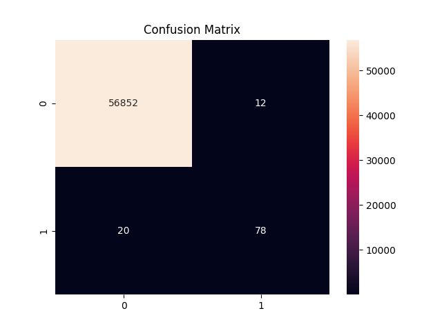
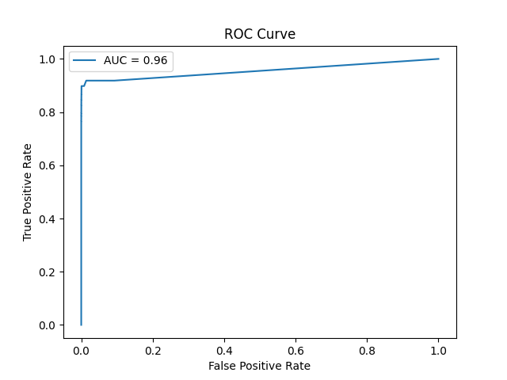
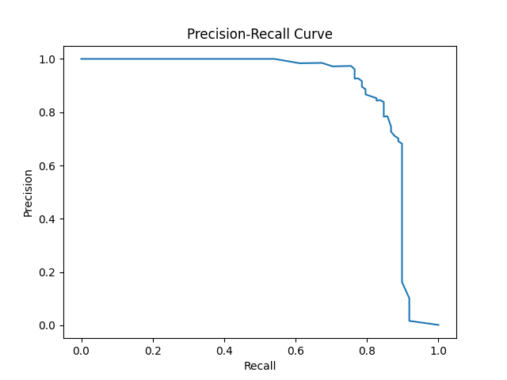

# 💳 Credit Card Fraud Detection System

## 📌 Overview

This project presents an end-to-end **Machine Learning system** for detecting fraudulent credit card transactions. It addresses the real-world challenge of **highly imbalanced data** and demonstrates how to build a complete ML pipeline—from data preprocessing to model deployment and user interaction.

The system integrates:

* A trained classification model
* A REST API for real-time scoring
* An interactive dashboard for visualization and predictions

---

## 🎯 Problem Statement

Credit card fraud is a significant issue in digital payments. Fraudulent transactions are extremely rare compared to legitimate ones, making detection difficult due to:

* Class imbalance
* Evolving fraud patterns
* Need for real-time decisions

---

## 🧠 Solution Approach

The system follows a structured pipeline:

1. **Data Preprocessing**

   * Cleaning and normalization
   * Handling missing values (if any)
   * Feature scaling

2. **Imbalanced Data Handling**

   * Applied SMOTE (Synthetic Minority Oversampling Technique)

3. **Model Training**

   * Random Forest Classifier
   * Optimized for fraud detection

4. **Evaluation**

   * Precision, Recall, F1-score
   * Confusion Matrix
   * ROC Curve & Precision-Recall Curve

5. **Deployment**

   * FastAPI backend for real-time predictions
   * Streamlit dashboard for user interaction

---

## 🛠️ Tech Stack

| Category        | Tools Used                  |
| --------------- | --------------------------- |
| Language        | Python                      |
| ML Libraries    | Scikit-learn, Pandas, NumPy |
| Visualization   | Matplotlib, Seaborn, Plotly |
| Backend API     | FastAPI                     |
| Frontend UI     | Streamlit                   |
| Model Handling  | Joblib                      |
| Version Control | Git & GitHub                |

---

## ⚙️ Features

* 🔍 Fraud detection using ML model
* ⚖️ Handles imbalanced dataset (SMOTE)
* 🌐 REST API for real-time prediction
* 🎨 Interactive UI dashboard
* 📊 Advanced visualizations:

  * Gauge chart (fraud probability)
  * Bar & Pie charts
  * Feature importance
* ⚙️ Adjustable prediction threshold
* 🧪 Demo mode (normal vs fraud samples)

---

## 📊 Model Performance

| Metric            | Score |
| ----------------- | ----- |
| Precision (Fraud) | 0.87  |
| Recall (Fraud)    | 0.80  |
| F1 Score          | 0.83  |
| Accuracy          | ~1.00 |

> Note: Recall is prioritized to reduce missed fraud cases.

---

## 🖥️ System Architecture

```text
Transaction Data → Preprocessing → Feature Engineering → Model → Prediction → API/UI Output
```

---

## 📸 UI Preview


---

## 📈 Visualizations

| Confusion Matrix                 | ROC Curve                 | PR Curve                 |
| -------------------------------- | ------------------------- | ------------------------ |
|  |  |  |

---

## 🚀 Getting Started

### 1️⃣ Clone Repository

```bash
git clone https://github.com/your-username/credit-card-fraud-detection-ml-system.git
cd credit-card-fraud-detection-ml-system
```

---

### 2️⃣ Install Dependencies

```bash
pip install -r requirements.txt
```

---

### 3️⃣ Train the Model

```bash
python main.py
```

---

### 4️⃣ Run the Streamlit Dashboard

```bash
streamlit run app.py
```

---

### 5️⃣ Run the API

```bash
uvicorn api:app --reload
```

Access API docs:

```
http://127.0.0.1:8000/docs
```

---

## 📂 Project Structure

```text
├── app.py              # Streamlit UI
├── api.py              # FastAPI backend
├── main.py             # Model training script
├── requirements.txt
├── images/             # Graphs & UI screenshots
├── src/                # Helper modules
```

---

## ⚠️ Important Notes

* Dataset is not included due to size constraints

* Download dataset from Kaggle:
  https://www.kaggle.com/datasets/mlg-ulb/creditcardfraud

* Run `main.py` to generate the trained model before using the app

---

## 🚀 Future Enhancements

* Real-time streaming (Kafka integration)
* Deep Learning models (LSTM, Autoencoders)
* Explainable AI (SHAP)
* Cloud deployment (AWS / GCP)
* Alert system for fraud detection

---

## 💼 Industry Relevance

This project reflects real-world systems used in:

* Banks and financial institutions
* Payment gateways
* Fintech platforms

It demonstrates skills in:

* Machine Learning
* Data Engineering
* API Development
* Full-stack ML systems

---

## 👨‍💻 Author

**Sujal kumar Shaw**

---

## ⭐ Acknowledgements

* Kaggle dataset contributors
* Open-source ML community
* Scikit-learn & FastAPI documentation

---
